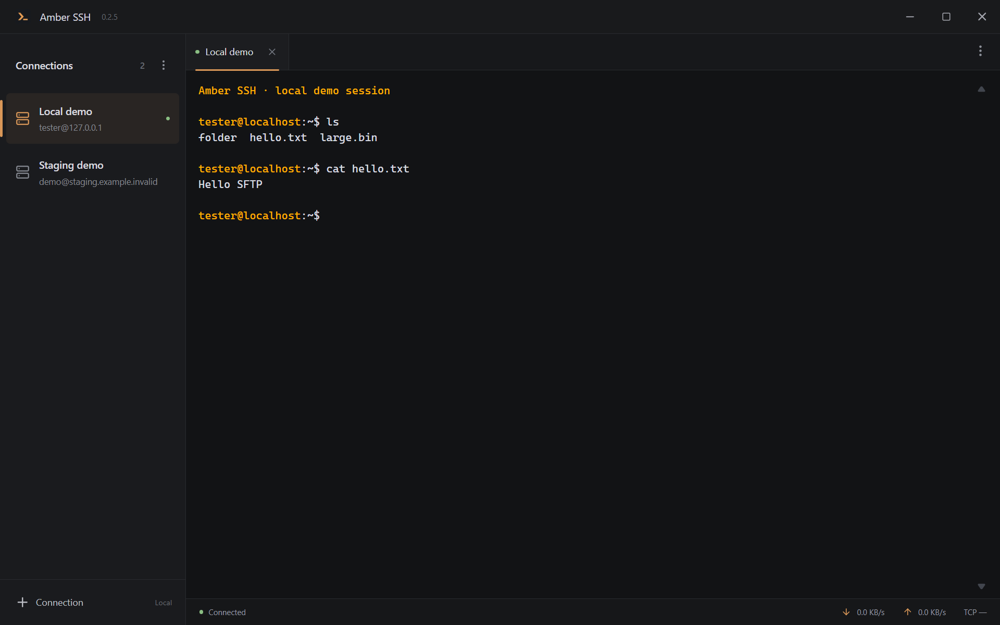
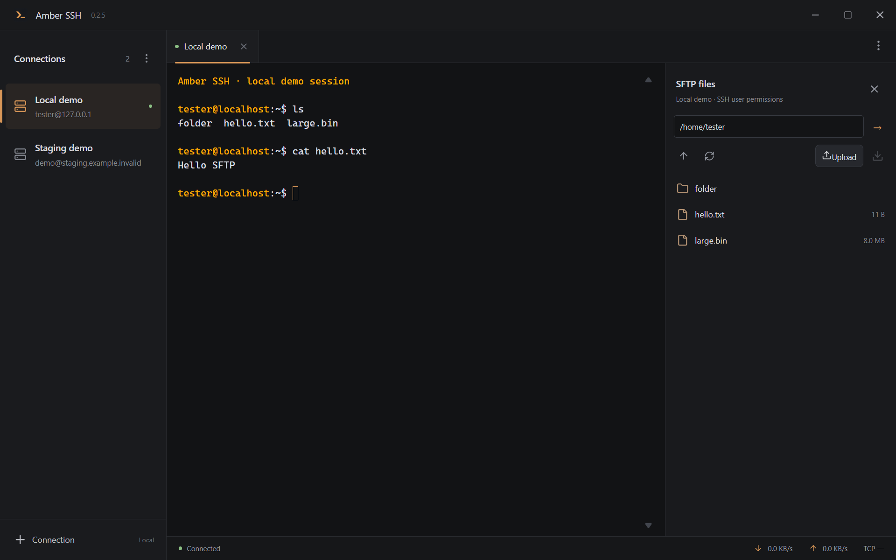

  

<h1 align="center">Amber SSH</h1>

Твой терминал. Только необходимое.

<a href="README.md">English</a> · <a href="https://github.com/O1SEeez/amber-ssh/releases">Скачать</a> · <a href="GUIDE.ru.md">Руководство</a> · <a href="https://github.com/O1SEeez/amber-ssh/issues">Обратная связь</a>

Минималистичный SSH-клиент для Windows и Linux. Спокойный тёмный интерфейс, оранжевые акценты и нужные функции под рукой.

## Скачать

| Платформа | Сборка | Версия |
| --- | --- | --- |
| Windows 10/11 x64 | [ZIP — рекомендуется](https://github.com/O1SEeez/amber-ssh/releases/download/v0.2.7/Amber-SSH-0.2.7-x64.zip) · [Один EXE](https://github.com/O1SEeez/amber-ssh/releases/download/v0.2.7/Amber-SSH-0.2.7-x64.exe) | 0.2.7 |
| Debian / Ubuntu / Mint x64 | [Установщик DEB](https://github.com/O1SEeez/amber-ssh/releases/download/v0.2.5/Amber-SSH-0.2.5-linux-amd64.deb) | 0.2.5 |
| Linux x64, включая Arch | [AppImage](https://github.com/O1SEeez/amber-ssh/releases/download/v0.2.5/Amber-SSH-0.2.5-linux-x86_64.AppImage) · [tar.gz](https://github.com/O1SEeez/amber-ssh/releases/download/v0.2.5/Amber-SSH-0.2.5-linux-x64.tar.gz) | 0.2.5 |

Это последние доступные сборки для каждой платформы. Версия для macOS пока в планах.

**Windows:** распакуйте всю папку ZIP и запустите `Amber SSH.exe` внутри неё. Остальные файлы должны оставаться рядом. Однофайловый EXE при каждом запуске распаковывается и может открываться дольше.

**Debian / Ubuntu / Mint:** `sudo apt install ./Amber-SSH-0.2.5-linux-amd64.deb`.

**AppImage:** выполните `chmod +x Amber-SSH-0.2.5-linux-x86_64.AppImage`, затем запустите файл. Без FUSE можно использовать `--appimage-extract-and-run` или архив tar.gz: распакуйте всю папку и запустите `./amber-ssh`. Для Arch подходит AppImage или архив; DEB для него не предназначен.

На Linux для сохранения паролей нужно разблокированное системное хранилище GNOME Keyring или KWallet. Без него отключите «Запомнить пароль».

**Сборки пока без цифровой подписи.** Windows может показать предупреждение или заблокировать запуск через Smart App Control. Контрольные суммы SHA256 в релизах проверяют целостность файла, но не заменяют подпись. Подробнее: [политика подписи](CODE_SIGNING.md).

## Возможности

- Сохранённые подключения, независимые вкладки терминала, вход по паролю или SSH-ключу.
- Локальное шифрование паролей средствами Windows DPAPI или системного хранилища Linux.
- Переход в root с сохранённым паролем пользователя, если на сервере разрешён sudo.
- Переподключение в той же вкладке с сохранением вывода и поиск по терминалу.
- Копирование и вставка независимо от раскладки; предпросмотр вставки четырёх и более строк.
- Быстрый поиск серверов, сохранённые команды с подтверждением, импорт и экспорт подключений без секретов.
- Перенос сохранённых паролей между компьютерами через зашифрованный файл (0.2.6+).
- Панель SFTP для просмотра папок и передачи отдельных файлов.
- Русский и английский интерфейс с переключением без закрытия сессий.

*Скриншоты настоящего приложения с отдельным локальным демонстрационным сервером. Личных серверов и паролей на них нет.*

## Первое подключение

1. Нажмите **+** под списком серверов, укажите имя, адрес и пользователя.
2. Выберите пароль или ключ. При необходимости включите сохранение пароля.
3. Подключитесь, сверьте fingerprint с доверенным источником и подтвердите ключ сервера.
4. В меню сессии **⋮** доступны SFTP, переподключение и переход в root.

`Ctrl+C` копирует выделение, а без выделения прерывает команду. `Ctrl+V` или ПКМ вставляет, `Ctrl+F` ищет по выводу, `Ctrl+K` открывает поиск подключения. Язык меняется в меню **⋮** рядом с «Подключения».

## Перенос с паролями (0.2.6+)

В меню **⋮** рядом с «Подключения» выберите **«Экспорт с паролями»**. Задайте длинный уникальный пароль файла (не менее 12 символов), повторите его и сохраните `.amber`. На втором компьютере выберите **«Импорт подключений»**, откройте этот файл, введите его пароль и подтвердите импорт. Пароли серверов заново вводить не нужно, если они были сохранены на исходном компьютере.

Весь список, включая имена и адреса серверов, зашифрован AES-256-GCM с ключом, полученным через scrypt. Пароль файла не сохраняется; восстановить его нельзя. Переносятся сохранённые пароли и секретные фразы ключей. Сами SSH-ключи и пути к ним, временные пароли, доверие к серверам и автоматический переход в root не переносятся. Ключи нужно выбрать отдельно, fingerprint — подтвердить заново. Дубликаты пропускаются.

Обычный JSON-экспорт по-прежнему не содержит секретов. На Linux для восстановления секретов нужно доступное системное хранилище. Linux 0.2.5 не поддерживает этот формат: для переноса нужна версия 0.2.6+ на обоих компьютерах. [Подробности формата](BACKUP.md).

## Текущий этап

Проект на ранней стадии, независимого аудита безопасности ещё не было. Локальное шифрование не защищает от вредоносной программы, работающей от вашего пользователя. Встроенной телеметрии, аналитики и проверок обновлений нет. Подробнее: [Security](SECURITY.md).

Автоввод sudo работает для действия перехода в root в приложении и стандартного запроса пароля; произвольные команды и MFA не автоматизируются. SFTP сохраняет права исходного SSH-пользователя. Передача папок, удаление/переименование, туннели, подсказки команд и смена темы пока не реализованы.

TCP в строке состояния — время установки соединения с SSH-портом, а не ICMP ping или задержка команд. RX/TX относится к терминалу; прогресс SFTP показан отдельно.

## Как помочь

Попробуйте сборку и [сообщите об ошибке](https://github.com/O1SEeez/amber-ssh/issues/new): укажите ОС, версию приложения, шаги и ожидаемый результат. Уберите настоящие адреса, пароли, ключи и секреты из вложений. Для уязвимостей используйте [приватный канал](SECURITY.md).

Отзывы, исправления и улучшения документации приветствуются. Если приложение полезно, звезда на GitHub поможет другим его найти. Правила участия и сборка из исходников — в [CONTRIBUTING.md](CONTRIBUTING.md) и [английском README](README.md).

[Подробное руководство](GUIDE.ru.md) · [История изменений](CHANGELOG.md) · [Лицензия MIT](LICENSE)
